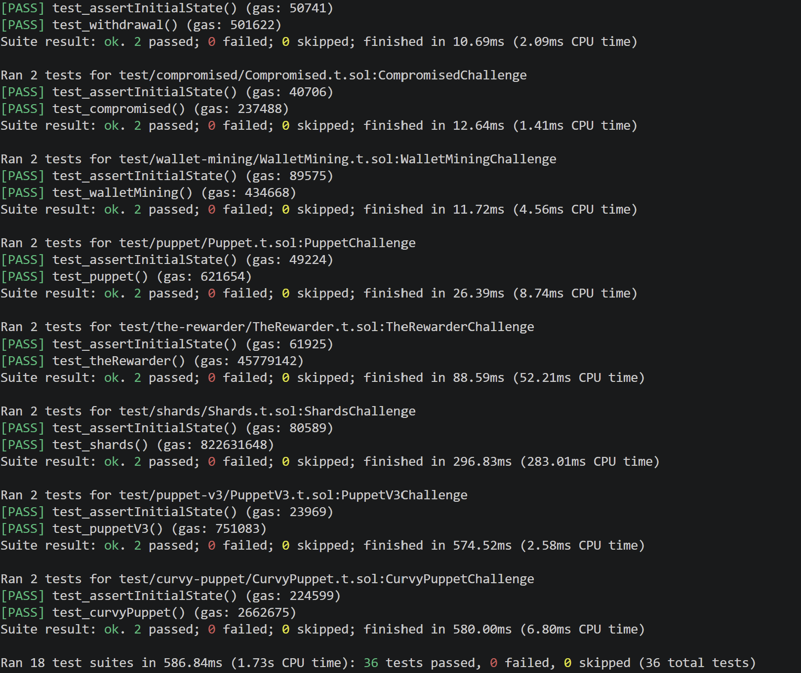

# My DVDeFi Journey
**Goal:** Understand smart contract's vulnerability concepts and DeFi system by solving all challenges and writing writeups.

## Progress
- 18/18 challenges solved
-  Current focus: all solved!

## Writeups
Each challenge has a writeup in three languages:

1. Unstoppable — [English](./writeupsEN.md#1-unstoppable) | [ไทย](./writeupsTH.md#1-unstoppable) | [日本語](./writeupsJA.md#1-unstoppable)
2. Naive Receiver — [English](./writeupsEN.md#2-naive-receiver) | [ไทย](./writeupsTH.md#2-naive-receiver) | [日本語](./writeupsJA.md#2-naive-receiver)
3. Truster — [English](./writeupsEN.md#3-truster) | [ไทย](./writeupsTH.md#3-truster) | [日本語](./writeupsJA.md#3-truster)
4. Side Entrance — [English](./writeupsEN.md#4-side-entrance) | [ไทย](./writeupsTH.md#4-side-entrance) | [日本語](./writeupsJA.md#4-side-entrance)
5. The Rewarder — [English](./writeupsEN.md#5-the-rewarder) | [ไทย](./writeupsTH.md#5-the-rewarder) | [日本語](./writeupsJA.md#5-the-rewarder)
6. Selfie — [English](./writeupsEN.md#6-selfie) | [ไทย](./writeupsTH.md#6-selfie) | [日本語](./writeupsJA.md#6-selfie)
7. Compromised — [English](./writeupsEN.md#7-compromised) | [ไทย](./writeupsTH.md#7-compromised) | [日本語](./writeupsJA.md#7-compromised)
8. Puppet — [English](./writeupsEN.md#8-puppet) | [ไทย](./writeupsTH.md#8-puppet) | [日本語](./writeupsJA.md#8-puppet)
9. Puppet V2 — [English](./writeupsEN.md#9-puppet-v2) | [ไทย](./writeupsTH.md#9-puppet-v2) | [日本語](./writeupsJA.md#9-puppet-v2)
10. Free Rider — [English](./writeupsEN.md#10-free-rider) | [ไทย](./writeupsTH.md#10-free-rider) | [日本語](./writeupsJA.md#10-free-rider)
11. Backdoor — [English](./writeupsEN.md#11-backdoor) | [ไทย](./writeupsTH.md#11-backdoor) | [日本語](./writeupsJA.md#11-backdoor)
12. Climber — [English](./writeupsEN.md#12-climber) | [ไทย](./writeupsTH.md#12-climber) | [日本語](./writeupsJA.md#12-climber)
13. Wallet Mining — [English](./writeupsEN.md#13-wallet-mining) | [ไทย](./writeupsTH.md#13-wallet-mining) | [日本語](./writeupsJA.md#13-wallet-mining)
14. Puppet V3 — [English](./writeupsEN.md#14-puppet-v3) | [ไทย](./writeupsTH.md#14-puppet-v3) | [日本語](./writeupsJA.md#14-puppet-v3)
15. ABI Smuggling — [English](./writeupsEN.md#15-abi-smuggling) | [ไทย](./writeupsTH.md#15-abi-smuggling) | [日本語](./writeupsJA.md#15-abi-smuggling)
16. Shards — [English](./writeupsEN.md#16-shards) | [ไทย](./writeupsTH.md#16-shards) | [日本語](./writeupsJA.md#16-shards)
17. Curvy Puppet — [English](./writeupsEN.md#17-curvy-puppet) | [ไทย](./writeupsTH.md#17-curvy-puppet) | [日本語](./writeupsJA.md#17-curvy-puppet)
18. Withdrawal — [English](./writeupsEN.md#18-withdrawal) | [ไทย](./writeupsTH.md#18-withdrawal) | [日本語](./writeupsJA.md#18-withdrawal)

## PoC
